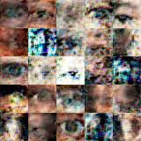
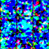

# Renaissance GAN: A Convolutional Generative Adversarial Network for Creating Music
2017/18 CC CS Senior Project on Generative Adversarial Networks (GANs) - Eli, Calvin, Aidan, Nikhil

## Abstract:
Music, perhaps more so than any other human activity,
is regarded as great expression of creativity and emotion.
Nonetheless, recent developments in machine learning have
expanded the boundaries of computer creativity. One of the
most promising developments is the Generative Adversarial
Network (GAN). By training two competing networks, a
GAN learns to output data resembling its input; one common
application is the production of realistic images from a dataset
of photographs. By reducing the problem of music generation
to that of image generation, we show that the same technique
can be used to create music as well as images. Our network
learns to generate and visualize original songs in the style
of its training input. Using a two-dimensional convolutional
GAN and the MIDI file format, we create multi-track songs
resembling the human-generated input.

## Paper:
https://www.dropbox.com/s/h3g01tdjh8yaiv6/renaissance-gan-convolutional.pdf?dl=0

## Results and Running Instructions



Run with:

```python3 unigan.py --input [Input .mid file, hdf5 file, or directory] --output [Ouput directory to be created]```

Optional arguments:

```
--epochs [How many epochs to stop after, default 12000] 
--batch [Batch size, default 5, 50 recommended for images]
--save-every [How often (in epochs) to save the image, default 100, 5 recommended for images]
--plot-every [How often (in epochs) to plot the image, default 100]
--no-display (Don't generate live display, necessary if X server is not set up.)

```

By default, GANiel will display a live feed of his generation, and, in the case of music, play generated files live.


